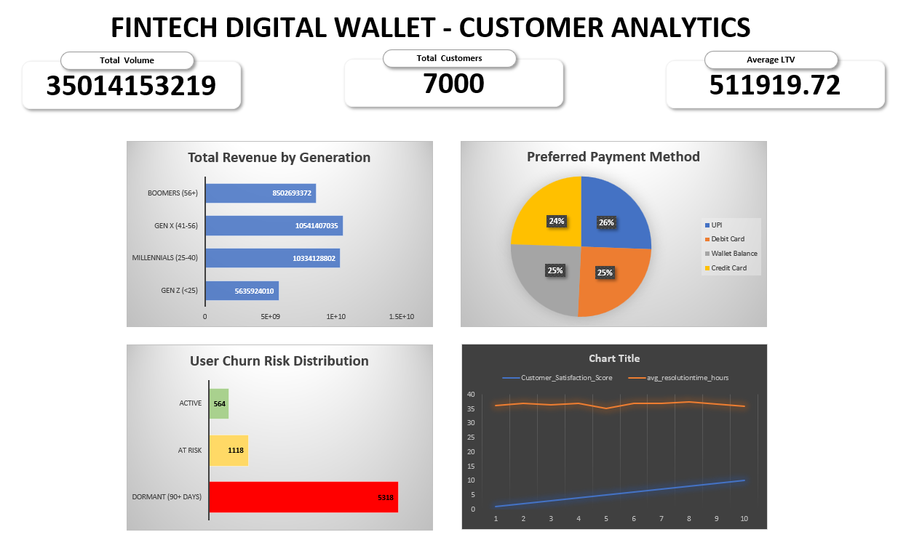

# Fintech Digital Wallet - Customer Data Analysis

## Project Overview
This project analyzes a dataset of digital wallet transactions to uncover actionable business insights. The goal was to deeply understand **Customer Lifetime Value (LTV)**, categorize user **Churn Risk**, and identify the most profitable demographics across the platform.

This end-to-end data analysis was conducted using advanced **SQL** and visualized through a dynamic, professional **Excel Dashboard**. 

## Tools & Technologies Used
- **SQL (PostgreSQL):** Used for advanced querying, data manipulation, Window Functions (`DENSE_RANK()`), and Common Table Expressions (CTEs).
- **Microsoft Excel:** Used for Data Visualization, data storytelling, and building a KPI Dashboard.
- **Relational Databases (Supabase):** Hosted the dataset for seamless online querying.

## Key Business Questions Answered
1. **Which generation spends the most?** Segmented users from Gen Z to Boomers to calculate total revenue driven by each generation.
2. **Who are the highest-value users?** Used Window Functions to independently rank the top 5 highest-spending customers in every unique geographical region.
3. **What is our Churn Profile?** Categorized users into "Active", "At Risk", and "Dormant" cohorts based on their transaction recency.
4. **Does Cashback actually work?** Correlated High vs. Low cashback reward tiers against the Average Lifetime Value of the user to determine the ROI of rewards programs.

## The Dashboard
*A high-level view of the Fintech platform's health and KPIs.*

> **Note:** The dashboard above visualizes the raw data exports generated from the SQL queries below.

## Key Insights Discovered
- **Demographics:** Millennials (Age 25-40) make up **30.0%** of the user base and drive **29.5%** of the total platform volume.
- **Payment Preferences:** **UPI** is the undisputed dominant payment method across the platform, driving both the highest transaction volume and the highest user preference rate.
- **Retention:** **76.0%** of users are classified as "Dormant" (no transactions in 90+ days), indicating an urgent need for a targeted re-engagement campaign.
- **Cashback ROI:** Surprisingly, users with High Cashback (>$3000) had an average LTV of **$509,633**, which is slightly lower than the **$513,425** LTV of low cashback users, suggesting diminishing returns on massive cashback rewards.

## Explore the Code
All of the SQL queries used to process, filter, and analyze this data are available in the [`wallet_queries.sql`](wallet_queries.sql) file located in this repository. 

Key SQL concepts demonstrated:
- Advanced `GROUP BY` and Aggregate Functions
- `CASE WHEN` Logic for conditional bucket segmentation
- `WITH` clauses / `CTE` (Common Table Expressions) for multi-step financial calculations
- `OVER (PARTITION BY ...)` Window functions

---
*Created by Tanishq Jain* | *Connect with me on [LinkedIn](https://www.linkedin.com/in/tanishq-jwork/)*
